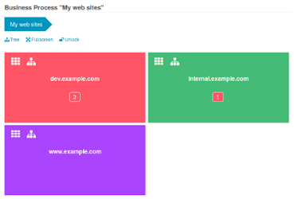
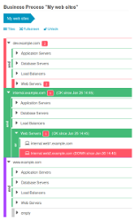
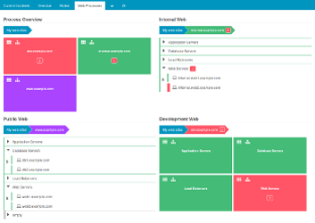

Business Processes - Icinga Web 2 module
========================================

If you want to visualize and monitor hierarchical business processes based on
any or all objects monitored by Icinga, the Icinga Web 2 business process
module is the way to go.

Want to create custom process-based dashboards? Trigger notifications at
process or sub-process level? Provide a quick top-level view for thousands of
components on a single screen? That's what this module has been designed for!

You're running a huge cloud, want to get rid of the monitoring noise triggered
by your auto-scaling platform but still want to have detailed information just
a couple of clicks away in case you need them? You will love this little module!

Documentation
-------------

### Basics
* [Installation](doc/02-Installation.md)
* [Getting Started](doc/03-Getting-Started.md)
* [Create your first process node](doc/04-Create-your-first-process-node.md)
* [Importing Processes](doc/05-Importing-Processes.md)
* [Customize Node Order](doc/06-Customize-Node-Order.md)
* [State Overrides](doc/07-State-Overrides.md)
* [Operators](doc/09-Operators.md)

### Web Components
* [Breadcrumb](doc/12-Web-Components-Breadcrumb.md)
* [Tile Renderer](doc/13-Web-Components-Tile-Renderer.md)
* [Tree Renderer](doc/14-Web-Components-Tree-Renderer.md)
* [Show Processes on a Dashboard](doc/16-Add-To-Dashboard.md)

### Storage
* [Store your Configuration](doc/21-Store-Config.md)
* [Upload an existing Configuration](doc/22-Upload-Config.md)

### The Project
* [Project History](doc/81-History.md)
