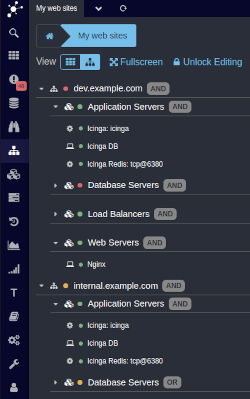

Business Processes - Icinga Web 2 module
========================================

If you want to visualize and monitor hierarchical business processes based on
any or all objects monitored by Icinga, the Icinga Web 2 business process
module is the way to go.

Want to create custom process-based dashboards? Trigger notifications at
process or sub-process level? Provide a quick top-level view for thousands of
components on a single screen? That's what this module has been designed for!

You're running a huge cloud, want to get rid of the monitoring noise triggered
by your auto-scaling platform but still want to have detailed information just
a couple of clicks away in case you need them? You will love this little module!

You got me! Where should I start from?
--------------------------------------

Please start with our [installation instructions](doc/01-Installation.md), head
on to our [getting started](doc/02-Getting-Started.md) introductions and learn
how to create your first [business process definitions](doc/03-Create-your-first-process-node.md).

You might also want to learn more about some interesting [web components](doc/12-Web-Components-Breadcrumb.md),
this projects [history](doc/81-History.md) or how to [contribute](doc/84-Contributing.md).

