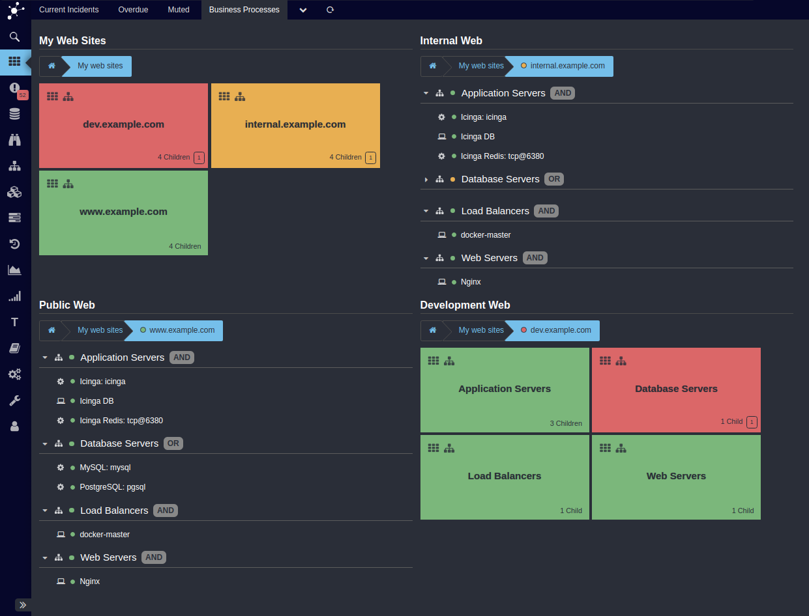

# Icinga Business Process Modeling

If you want to visualize and monitor hierarchical business processes based on
objects monitored by Icinga, Icinga Business Process Modeling is the solution.

Want to create custom process-based dashboards? Trigger notifications at
process or sub-process level? Provide a quick top-level view for thousands of
components on a single screen? That's what this module has been designed for!

You're running a huge cloud, want to get rid of the monitoring noise triggered
by your auto-scaling platform but still want to have detailed information just
a couple of clicks away in case you need them? You will love this little module!

## Documentation

* [Installation](02-Installation.md)
* [Getting Started](03-Getting-Started.md)
