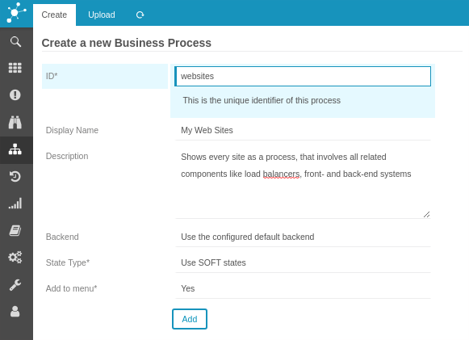
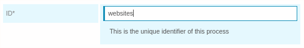
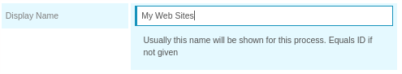
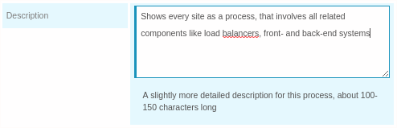
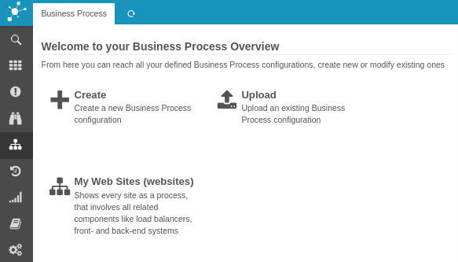

Getting Started
===========================================

Once you enable the *Business Process* module, it will pop up in your menu.
When you click on it, it will show you a new Dashboard:

A new Business Process configuration
-------------------------------------------

From here we choose to create a new *Business Process configuration*:

Let's have a look at the single fields:

### Configuration name

The Business Process definition will be stored with this name. This is going to
be used when referencing this process in URLs and in Check Commands.

### Title

You might optionally want to provide an additional title. In that case the title
is shown in the GUI, while the name is still used as a reference. The title will
default to the name.

### Description

Provide a short description explaining within 100-150 character what this
configuration provides. This will be shown on the Dashboard.

### Backend

**Hint:** *Usually this should not be changed*

Icinga Web 2 currently uses only one Monitoring Backend, but in theory you
could configure multiple ones. They won't be usable in a meaningful way at the
time of this writing. Still, you might want to use a different backend as a data
provider for your Business Process.

### State Type

You can decide whether `SOFT` or `HARD` states should be the used as a base when
calculating the state of a Business Process definition.

### Add to menu

Business Process configurations can be linked to the Icinga Web 2 menu. Only the
first five configurations a user is allowed to see will be shown there:

That's all for now, click `Add` to store your new (still empty) Business Process
configuration.

Empty configuration
===================

You are redirected to your newly created Business Process configuration:

From here we can now add as many deeply nested Business Processes as we want.
But let's first have a look at our Dashboard once again:

Now let's move on and [create your first Nodes](03-Create-your-first-process-node.md).
