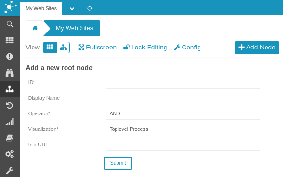
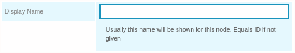
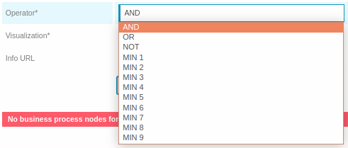
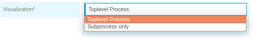
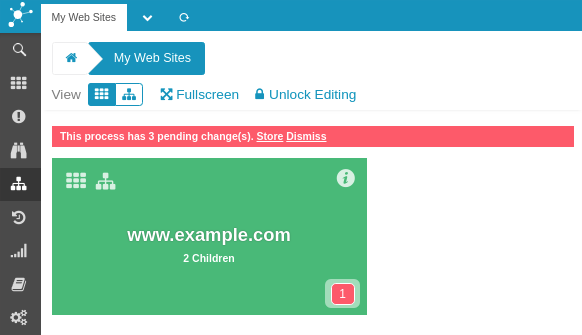

Create your first Business Process Node
==================================================================================

A *Business Process Node* consists of a *name*, *title*, an *operator* and one or
more child nodes. It can be a Root Node, child node of other Business Process
Nodes - or both.

Configuring our first node
--------------------------

To create our first *Business Process Node* we click the *Add* button. This
leads to the related configuration form:

First setting is the *Node name*, an identifier that must be unique throughout
all Nodes that are going to be defined. This identifier will be used in every
link and also in *Check Commands* referring this node from an Icinga *Service
Check*.

### Set a title

As uniqueness sometimes leads to not-so-beautiful names, you are additionally
allowed to specify a title. This is what the frontend is going to show:

### Choose an operator

Every Business Process requires an *Operator*. This operator defines it's
behaviour, this specifies how it's very own state is going to be calculated:

### Specify where to display

The form suggests to create a *Toplevel Process*. It does so as we are about
to create a new *root node*. We could alternatively also create a sub process.
As we are currently not adding it to another Node, this would lead to an *Unbound
Node* that could be linked later on.

### Provide an optional Info URL

One might also want to provide a link to additional information related to a
specific process. This could be instructions with more technical details or
hints telling what should happen if outage occurs. You might not want to do so
for every single Node, but it might come in handy for your most important (top
level?) nodes:

That's it, your are ready to submit the form.

### First Business Process Node ready

You are now shown your first Business Process Node. A red bar reminds you that
your pending changes have not been stored yet:

You could now *Store the Configuration* or move on with adding additional nodes
to complete your configuration.

**Hint**: the blue arrow makes part of a breadcrumb showing your current position.
 You might want to learn more about [breadcrumbs](12-Web-Components-Breadcrumb.md).