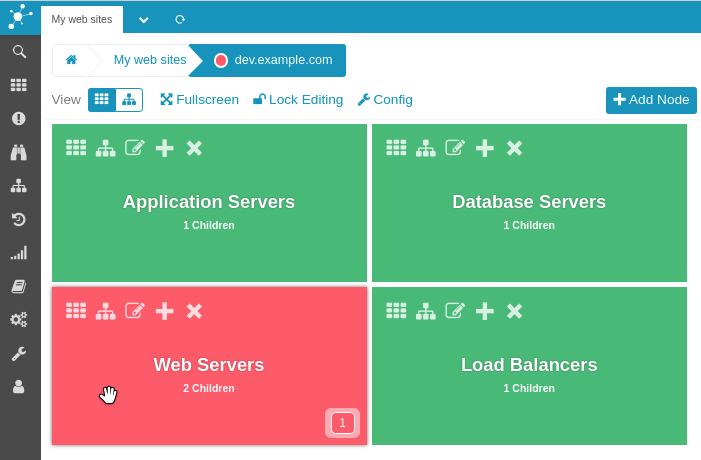
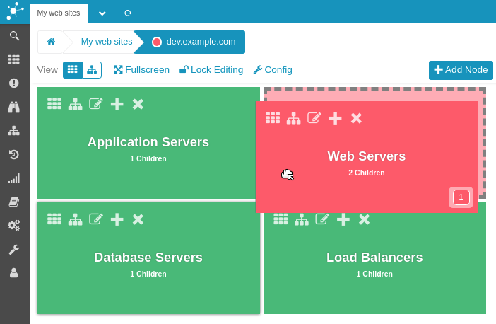
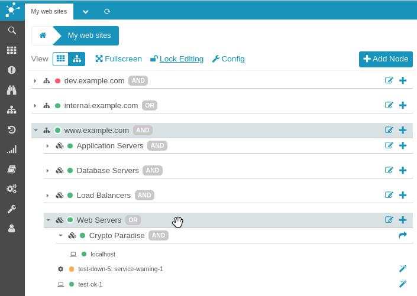
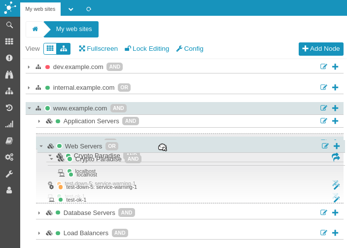

Customize Node Order
=====================================================

By default all nodes are ordered alphabetically while viewing them in the UI.
Though, it is also possible to order nodes entirely manually.

> **Note**
>
> Once manual order is applied (no matter where) alphabetical order is
> disabled for the entire configuration.

Reorder by Drag'n'Drop
----------------------

Make sure to unlock the configuration first to be able to reorder nodes.

### Tile View

To move a tile simply grab it with your mouse and drag it to the location you
want it to appear at.

### Tree View

While in tree view nodes can be moved the same way. You just have a narrower
area to grab them.

Tree view also has an advantage the tile view has not. It is possible to move
nodes within the entire hierarchy. But remember to unfold processes first, if
you want to move a node into them.
