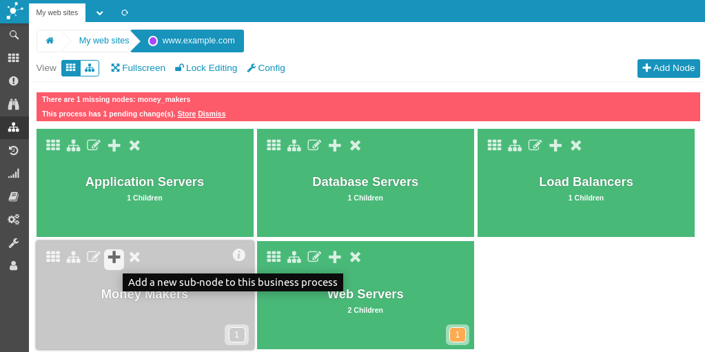
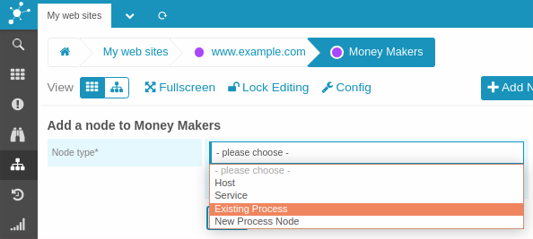
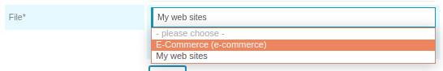
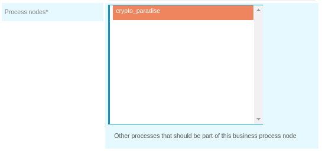
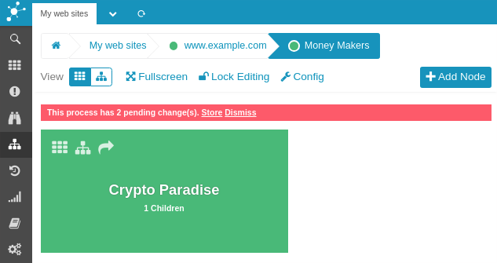
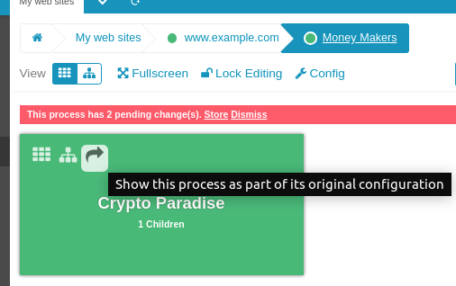

Importing Processes
===================================================

To avoid redundancy and make complex *Business Process Configurations* easier
to maintain it is possible to import processes from other configurations.

In order to be able to import a process create a root node first. You cannot
import processes into the root level.

Importing a Process
-------------------

Once the related configuration form is open, choose `Existing Process` and wait
for the form to refresh.

### Choose Configuration

You can now choose the configuration to import processes from. Or simply hit
`Next` to just utilize a process from the current configuration.

### Select Processes

Now select the processes you want to import and submit the form.

### Import Successful

You are now looking at the result. The process has been imported. Do not forget
to save your changes!

Navigation with Imported Processes
----------------------------------

### Seamless Breadcrumbs

You may have already noticed that the breadcrumbs integrate the hierarchy
of the imported process. Once you navigate further the actions below the
breadcrumbs change and don't permit to unlock editing.

To change imported processes you need to open them in their original
configuration first. To do so click on the arrow to the right which is
displayed in a tile's action urls in the upper left. While in tree view
these can be found at the very right of an process' row.

