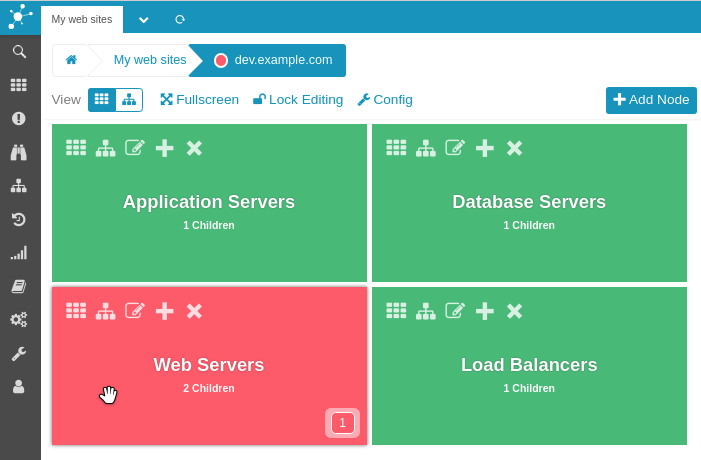

# Customize Node Order

By default all nodes are ordered alphabetically while viewing them in the UI.
Though, it is also possible to order nodes entirely manually.

> **Note**
>
> Once manual order is applied (no matter where) alphabetical order is
> disabled for the entire configuration.

## Reorder by Drag'n'Drop

Make sure to unlock the configuration first to be able to reorder nodes.

### Tile View

To move a tile simply grab it with your mouse and drag it to the location you
want it to appear at.




### Tree View

While in tree view nodes can be moved the same way. You just have a narrower
area to grab them.


The tree view also has an advantage the tile view has not. It is possible to
move nodes within the entire hierarchy. But remember to unfold processes first,
if you want to move a node into them.

## File Format Extensions

The configuration file format has slightly been changed to accommodate the new
manual order. Though, previous configurations are perfectly upwards compatible.

### New Header

A new header is used to flag a configuration file as being manually ordered.

```
# ManualOrder    : yes
```

Once this is set alphabetical order is disabled and only the next techniques
define the order of nodes.

### Changed `display` Semantic

Previously there were only two valid values for the `display` directive.
(0 = Subprocess, 1 = Toplevel Process)

```
display 0|1;<name>;<title>
```

This has now been extended so that values greater than zero refer to the order
of root nodes. (ascending)

```
display 0|n;<name>;<title>
```

### Significant Children Order

Previously the order of a node's children in a configuration file was not
important in any way. Now this is significant and refers to the order in
which children appear in the UI and how process states are determined.
