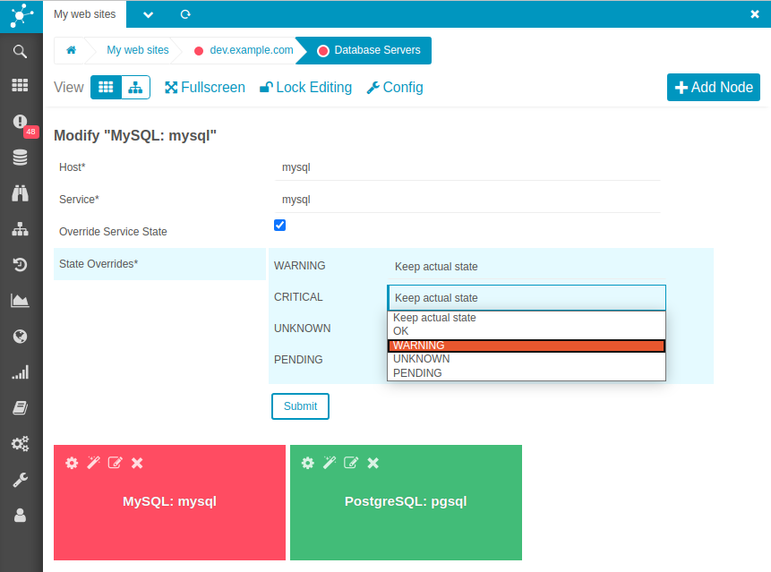
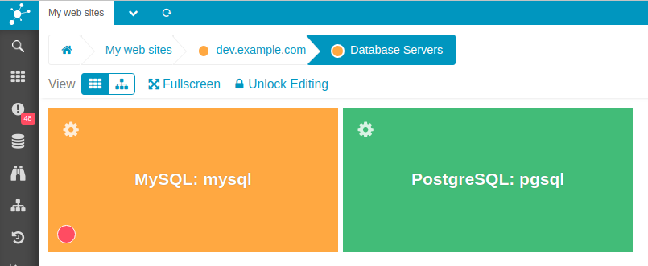
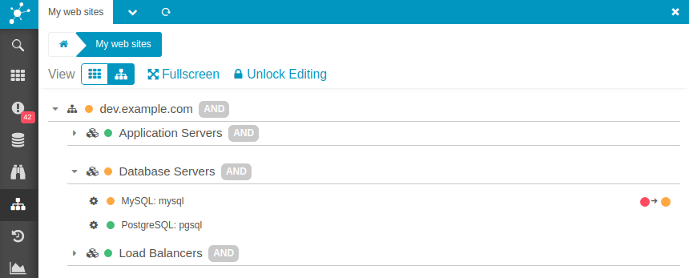

# State Overrides

Business processes utilize their children's states to calculate their own state.
While you can influence this with [operators](09-Operators.md), it's also possible
to override individual states. (This applies to host and service nodes.)

## Configuring Overrides

State overrides get configured per node. When adding or editing a node, you can
define which state should be overridden with another one.

Below `WARNING` is chosen as a replacement for `CRITICAL`.



## Identifying Overrides

In tile view overridden states are indicated by an additional state ball in the
lower left of a tile. This is then the actual state the object is in.



In tree view overridden states are indicated on the very right of a row. There
the actual state is shown and which one it is replaced with.



## File Format Extensions

The configuration file format has slightly been changed to accommodate state
overrides. Though, previous configurations are perfectly upwards compatible.

### New Extra Line

For process nodes a new extra line is used to store state overrides.

```
state_overrides dev_database_servers!mysql;mysql|2-1
```

The full syntax for this is as follows:

```
state_overrides <process>!<child>|n-n[!<child>|n-n[,n-n]]
```
