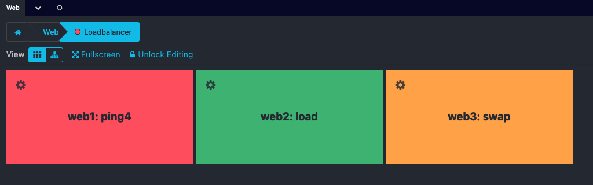
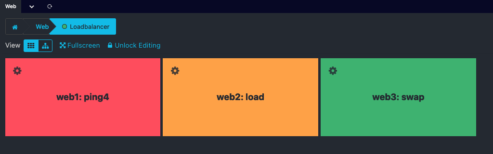
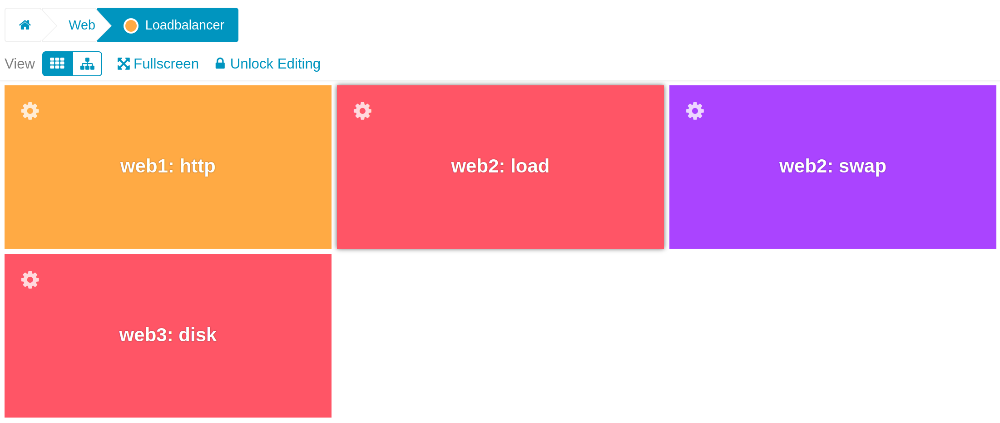
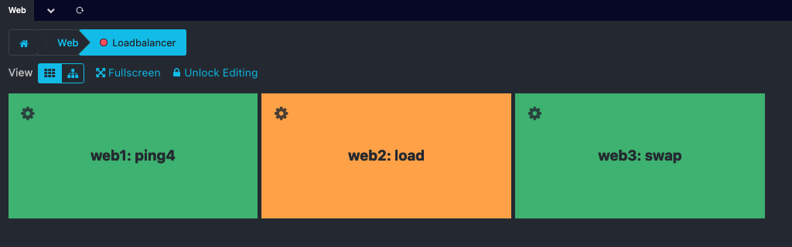
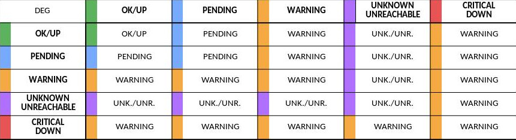
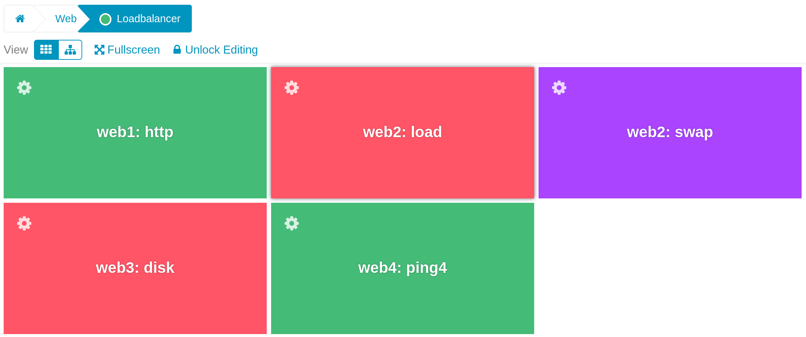

# Operators

Every Business Process requires an Operator. This operator defines its behaviour and specifies how its very own state is
going to be calculated.

## AND

The `AND` operator selects the **WORST** state of its child nodes:

## OR

The `OR` operator selects the **BEST** state of its child nodes:

## XOR

The `XOR` operator shows OK if only one of n children is OK at the same time. In all other cases the parent node is CRITICAL.
Useful for a service on n servers, only one of which may be running. If both were running,
race conditions and duplication of data could occur.

## DEGRADED

The `DEGRADED` operator behaves like an `AND`, but if the resulting
state is **CRITICAL** it transforms it into a **WARNING**.
Refer to the table below for the case-by-case
analysis of the statuses.

## MIN n

The `MIN` operator selects the **WORST** state out of the **BEST n** child node states:

## RATE n

The `RATE` operator selects the **WORST** state out of the **BEST n** rate child node states.
