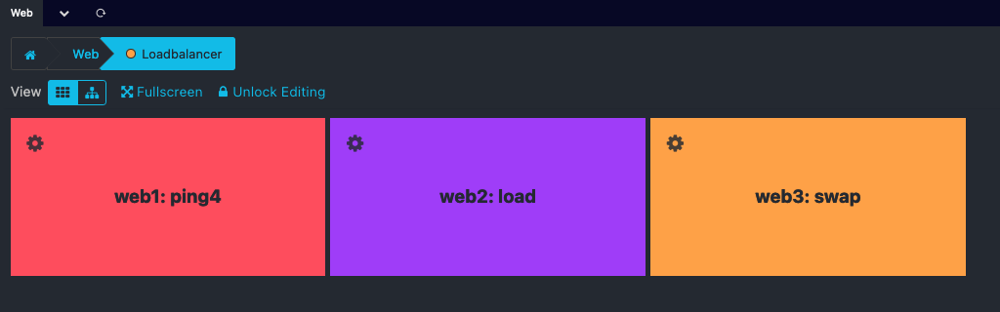

# Operators <a id="operators">

Every Business Process requires an Operator. This operator defines its behaviour and specifies how its very own state is
going to be calculated.

## AND <a id="and-operator">

The `AND` operator selects the **WORST** state of its child nodes:

## OR <a id="or-operator">

The `OR` operator selects the **BEST** state of its child nodes:

## DEGRADED <a id="deg-operator">

The `DEGRADED` operator behaves like an `AND`, but if the resulting
state is **CRITICAL** it transforms it into a **WARNING**.
Refer to the table below for the case-by-case
analysis of the statuses.

## MIN n <a id="min-operator">

The `MIN` operator selects the **WORST** state out of the **BEST n** child node states:

