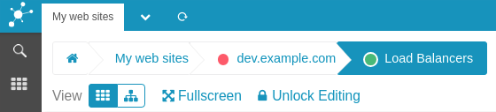
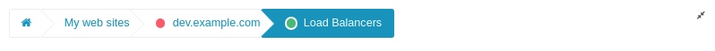

Web Components: Breadcrumb
================================================================

All Business Process renderers show a **breadcrumb** component to always give
you a quick indication of your current location. 

The left-most section shows the title of the current *Business Process Configuration*.
The remaining sections show the path to the current *Business Process Node* currently
being shown.

Hovering the Breadcrumb with your mouse shows you that all of it sections are
highlighted, as they are links pointing to either the root level when clicking
on the *Configuration Node* itself or to the corresponding *Business Process Node*.

All but the last section, showing your current position in the tree. Even if
not being highlighted, it is still a link an can be clicked in case you neeed
so.

In case you're showing some related details in a split-screen view of *Icinga
Web 2*, a click on any *Breadcrumb* section will switch back to a wide single
column view to make it obvious that you moved to another context. It is also
perfectly legal to open any of the available links in a new browser tab or
window.

Available actions below the Breadcrumb
--------------------------------------

### Choose a renderer

The first link allows to toggle the used Renderer. Currently a *Tree* and a
*Tile* renderer are available. 

### Move to Full Screen Mode

Every view can be shown in *Full Screen Mode*. Full screen means that left and
upper menu together with some other details are hidden. Your Business Process
will be able to use all of the available space. Want even more? Then please
additionally switch your browser to full screen mode. This is usually done by
pressing the `F11` key.

Once being in full screen mode you'll find an icon on the right side that will
allow you to switch back to normal view:

**Hint:** We know that the web application might request real full screen mode
on their own. We refused doing so as many people find this being an annoying
feature.

### Unlock the Configuration

When clicking `Unlock`, additional actions are shown. One of them is immediately
shown next to the `Unlock` link and reads `Config`. It allows you to reach Configuration
settings for the your currently loaded *Business Process Configutation*:

But there is more. When unlocked, all nodes provide links allowing to modify or
to delete them. Host/Service Nodes now allow you to simulate a specific state.

Other main actions
------------------

### Add content to your Dashboard

When being in *locked* mode, you are allowed to add the currently shown process
at the given path with the active renderer in the main (or a custom) [Icinga Web 2
Dashboard](16-Add-To-Dashboard.md):

