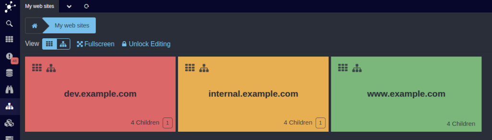

Web Components: Tile Renderer
======================================================================

The default Business Process *Renderer* is the *Tile Renderer*. It always shows
one level of your tree, enriched with badges giving some hint on lower level
node problems. This is what it looks like:

Please click on *Tree* below the [breadcrumb](12-Web-Components-Breadcrumb.md)
to switch to the [Tree View](14-Web-Components-Tree-Renderer.md). In the left
corner of every *Tile* you can find two icons, both of them will show the related
sub-process. On your mobile phone this usually replaces your current view, please
use the [breadcrumb](12-Web-Components-Breadcrumb.md) to navigate back to a higher
level.

On a Notebook or Desktop Computer this usually leady to a split-screen view:

This example shows a subtree shown with the [Tree Renderer](14-Web-Components-Tree-Renderer.md),
it is of course also perfectly legal to drill down using the *Tile Renderer*
only.
