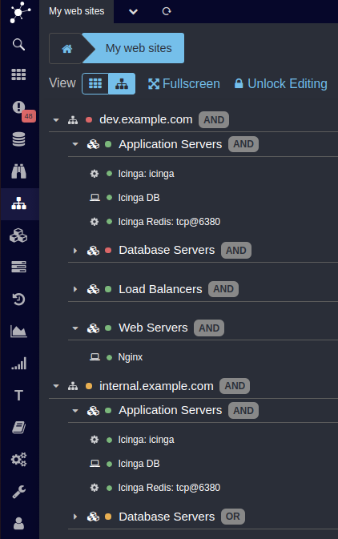

Web Components: Tree Renderer
======================================================================

The main advantage of the *Tree Renderer* is that it is able to show all nodes
of Business Process trees at once. This works fine even for huge trees with lots
of nodes. Please have a look at this screenshot to get an idea of how the tree
view looks like:

Clicking Business Process Nodes collapses or unfolds them, clicking single hosts
or services show the related monitored object. You can of course always switch
back to the [Tile Renderer](13-Web-Components-Tile-Renderer.md) with a single
click at any time.
