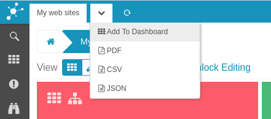
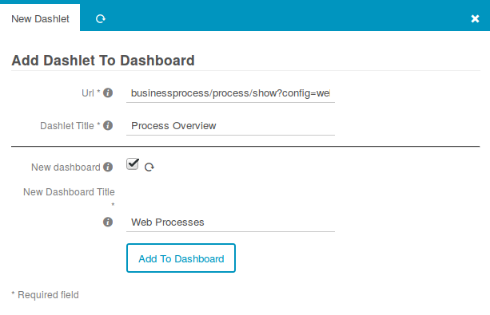
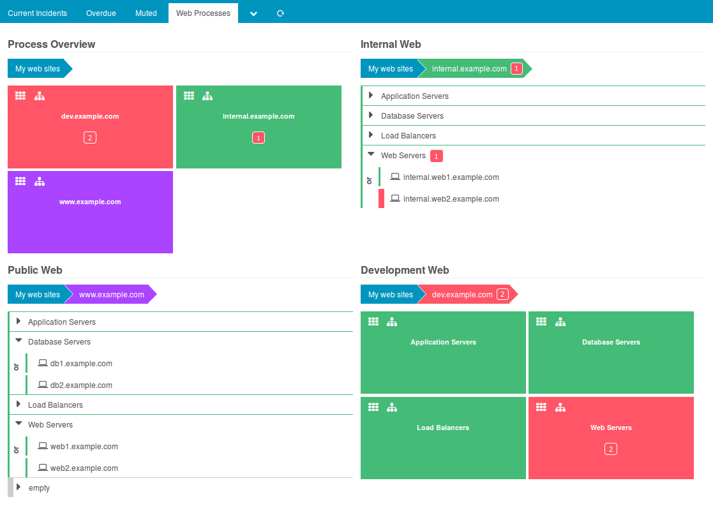

Show Processes on a Dashboard
==========================================================

When being in *Locked mode*, you can add any Business Process at top or sub level
to any Icinga Web 2 Dashboard. The related link can be found in the Tab bar:

This leads to the standard Icinga Web 2 *Add Dashlet to Dashboard* form. Feel
free to add your Business Process View to any existing Dashboard. You might also
want to create a dedicated Dashboard as shown in this example:

Want more?
----------

Head on and add multiple Business Processes to your Dashboard to show all of
them at once:

