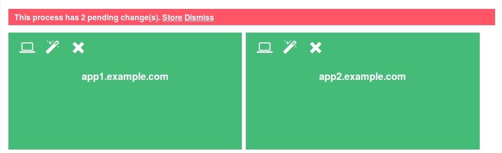
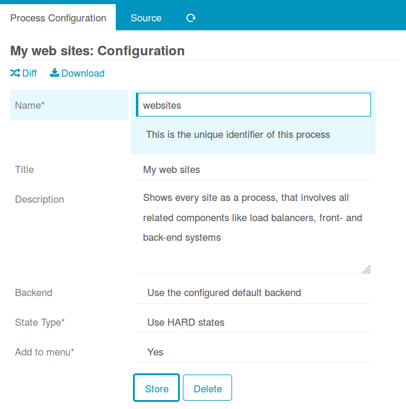
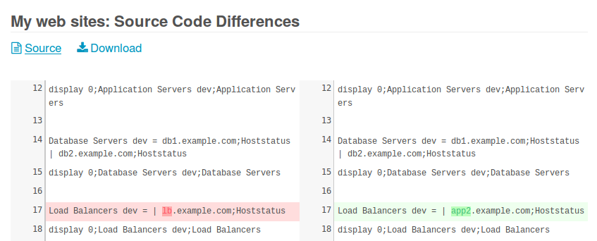

Store your Configuration
=================================================

Changes to your *Business Process Configuration* are added to a stack and will
not be stored immediately. In case there are pending unstored changes, this will
be shown on every screen:

A click on *Dismiss* immediately throws away all unstored changes. A click on
*Store* brings you to the configuration form. You have seen this before, once
you created your [very first configuration](02-Getting-Started.md):

Config Diff
-----------

If unsure what changes you're going to store, you can still check the *Config Diff*
before finally storing to disk:

You can also download your existing configuration to safe it elsewhere or to
apply manual modifications with our favourite plaintext editor.
