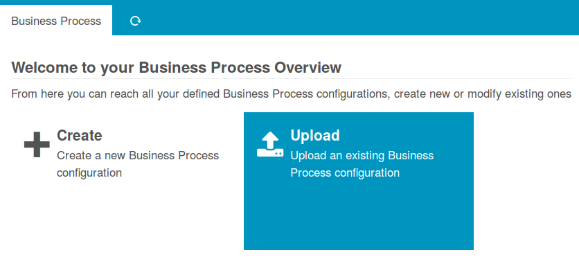
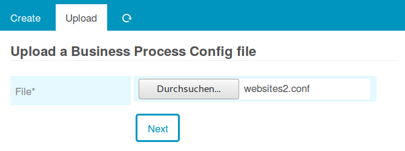
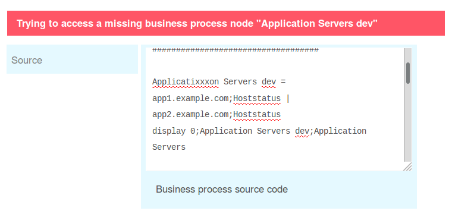
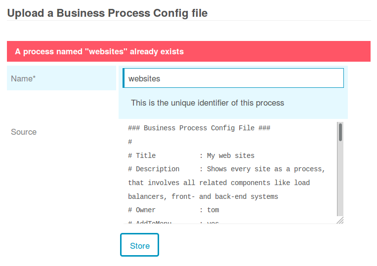

Upload a Configuration File
=====================================================

You can upload a formerly downloaded or even a manually created file directly
through the web frontend. Given sufficient permissions, the Dashboard provides
a related link:

Chose a file
------------

This can be any file:

It should be valid of course, but don't worry - the *Business Process* module
protects you from syntax errors:

Just for fun you could try to upload an image or whatever you want - it will not
break. It will also protect you from accidentally overwriting existing files:

So in case you need to replace an existing process, please delete it before
uploading a new one.
