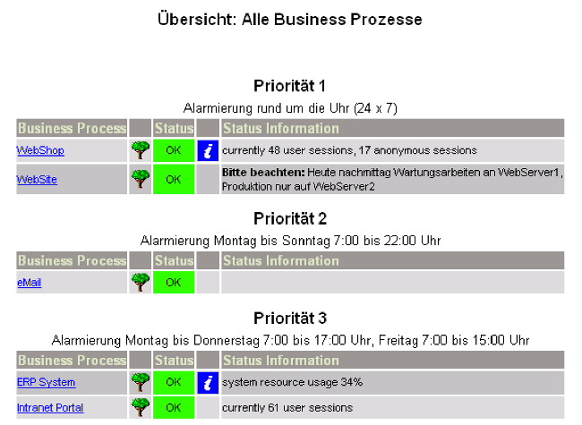
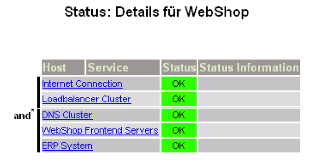

Project History
===============

The Business Process module is based on the ideas of the Nagios(tm) [Business
Process AddOn](http://bp-addon.monitoringexchange.org/) written by Bernd
Strößenreuther. We always loved it's simplicity, and while it looks pretty
oldschool right now there are still many shops happily using it in production.

Compatibility
-------------

We fully support the BPaddon configuration language and will continue to do so.
It's also perfectly valid to run both products in parallel based on the very same
config files. New features are (mostly) added in a compatible way.

Configuration titles and descriptions, properties related to state types or
permissions are examples for new features that didn't formerly exist. They are
stored as commented metadata in the file header and therefore invisible to the
old AddOn.

The only way to break compatibility is to use newly introduced operators like
`ǸOT`. Once you do so, the old AddOn will no longer be able to parse your
configuration.

Lot's of changes went on and are still going on under the hood. We have more
features and new language constructs. We separated the config reader from the
state fetcher in our code base. This will allow us to eventually support config
backends like SQL databases or the Icinga 2 DSL.

This would make it easier to distribute configuration in large environments.

Improvements
------------

Major focus has been put on execution speed. So while the Web integration shows
much more details at once and is able to display huge unfolded trees, it should
still render and refresh faster. Same goes for the Check Plugin.

Behaviour for all operators is now strictly specified and Unit-tested. You still
can manually edit your configuration files. But much better, you also delegate
this to your co-workers, as Business Process definitions can now be built directly
in the GUI.
